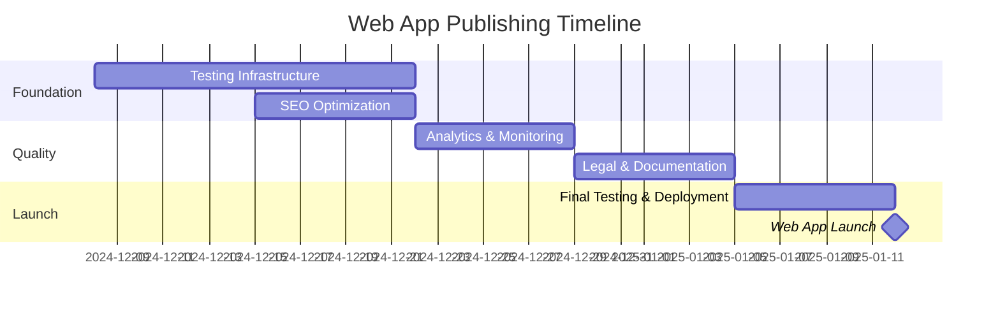
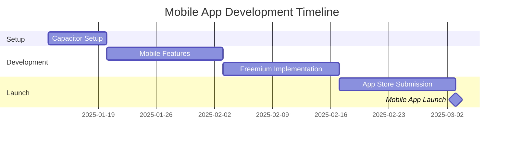

# 🚀 Publishing Strategy & Development Roadmap

**Activity Finder - Path to Professional Web & Mobile Release**

*Last Updated: December 2024*

---

## Executive Summary

This document outlines the complete strategy for publishing the Activity Finder app as a professional-grade web application (free version) and subsequently converting it to a freemium mobile app. It includes gap analysis, required features, development timeline, and quality benchmarks.

### Current Status

✅ **Strengths:**
- Solid core functionality with premium UI/UX
- Full authentication system with PostgreSQL backend
- Deployment-ready architecture (Vercel + Render)
- Comprehensive documentation
- Mobile-responsive design

⚠️ **Gaps for Professional Publishing:**
- No automated testing infrastructure
- Missing SEO optimization
- No analytics/monitoring
- Limited error handling and logging
- No CI/CD pipeline
- Missing legal pages (Privacy, Terms)

---

## Table of Contents

1. [Web Publishing Readiness](#web-publishing-readiness)
2. [Gap Analysis](#gap-analysis)
3. [Development Roadmap](#development-roadmap)
4. [Mobile Conversion Strategy](#mobile-conversion-strategy)
5. [Quality Benchmarks](#quality-benchmarks)
6. [Timeline & Milestones](#timeline--milestones)

---

## Web Publishing Readiness

### Phase 1: Pre-Launch Essentials (2-3 weeks)

#### 1.1 Testing Infrastructure ⚠️ **CRITICAL**

**Current State:** No automated tests  
**Required:** Comprehensive test coverage

**Action Items:**

- [ ] **Unit Tests** (Target: 70%+ coverage)
  - Install testing framework: Vitest + React Testing Library
  - Test critical services: `authService`, `activityService`, `geocodingService`
  - Test utility functions: `formatters`, `validators`
  - Test custom hooks: `useAuth`, `useFavorites`
  
- [ ] **Integration Tests**
  - API endpoint tests (auth, favorites, health)
  - Database operations (CRUD for users, favorites)
  - Authentication flow (register, login, logout, token refresh)
  
- [ ] **E2E Tests** (Critical user flows)
  - User registration and login
  - Search and filter activities
  - Add/remove favorites
  - View switching (list ↔ map)
  - Theme toggle (light ↔ dark)

**Tools:**
```json
{
  "devDependencies": {
    "vitest": "^1.0.0",
    "@testing-library/react": "^14.0.0",
    "@testing-library/jest-dom": "^6.0.0",
    "@testing-library/user-event": "^14.0.0",
    "supertest": "^6.3.0"
  }
}
```

**Commands to Add:**
```json
{
  "scripts": {
    "test": "vitest",
    "test:ui": "vitest --ui",
    "test:coverage": "vitest --coverage",
    "test:e2e": "playwright test"
  }
}
```

---

#### 1.2 SEO Optimization ⚠️ **HIGH PRIORITY**

**Current State:** Basic meta tags only  
**Required:** Professional SEO implementation

**Action Items:**

- [ ] **Meta Tags Enhancement**
  - Add Open Graph tags for social sharing
  - Add Twitter Card meta tags
  - Dynamic meta descriptions per page
  - Canonical URLs
  
- [ ] **Structured Data (JSON-LD)**
  - Organization schema
  - WebApplication schema
  - LocalBusiness schema for activities
  
- [ ] **Performance Optimization**
  - Image optimization (WebP format, lazy loading)
  - Code splitting by route
  - Bundle size analysis and reduction (target: <500KB)
  - Implement service worker for offline support
  
- [ ] **Sitemap & Robots.txt**
  - Generate dynamic sitemap.xml
  - Configure robots.txt
  - Submit to Google Search Console

**Files to Create:**
- `public/robots.txt`
- `public/sitemap.xml`
- `src/components/SEO/MetaTags.tsx`
- `src/utils/seo.ts`

**Example Implementation:**
```typescript
// src/components/SEO/MetaTags.tsx
interface MetaTagsProps {
  title: string;
  description: string;
  image?: string;
  url?: string;
}

export function MetaTags({ title, description, image, url }: MetaTagsProps) {
  const fullTitle = `${title} | Activity Finder`;
  const defaultImage = '/og-image.png';
  
  return (
    <Helmet>
      <title>{fullTitle}</title>
      <meta name="description" content={description} />
      
      {/* Open Graph */}
      <meta property="og:title" content={fullTitle} />
      <meta property="og:description" content={description} />
      <meta property="og:image" content={image || defaultImage} />
      <meta property="og:url" content={url || window.location.href} />
      
      {/* Twitter Card */}
      <meta name="twitter:card" content="summary_large_image" />
      <meta name="twitter:title" content={fullTitle} />
      <meta name="twitter:description" content={description} />
      <meta name="twitter:image" content={image || defaultImage} />
    </Helmet>
  );
}
```

---

#### 1.3 Analytics & Monitoring ⚠️ **HIGH PRIORITY**

**Current State:** No tracking  
**Required:** Privacy-friendly analytics

**Action Items:**

- [ ] **Analytics Implementation**
  - Install privacy-friendly analytics (Plausible or Umami)
  - Track key events: searches, favorites, registrations
  - Set up conversion funnels
  - Monitor user retention
  
- [ ] **Error Tracking**
  - Implement Sentry or similar for error monitoring
  - Track API failures and network errors
  - Monitor performance metrics
  - Set up alerts for critical errors
  
- [ ] **Performance Monitoring**
  - Core Web Vitals tracking
  - API response time monitoring
  - Database query performance
  - Cold start time tracking (Render)

**Tools:**
- **Analytics:** Plausible (GDPR-compliant, no cookies)
- **Error Tracking:** Sentry (free tier: 5K events/month)
- **Uptime Monitoring:** UptimeRobot (free tier: 50 monitors)

**Environment Variables to Add:**
```env
VITE_ANALYTICS_DOMAIN=your-domain.com
VITE_SENTRY_DSN=your-sentry-dsn
```

---

#### 1.4 Legal & Compliance 🔒 **REQUIRED**

**Current State:** Missing legal pages  
**Required:** Privacy Policy, Terms of Service, Cookie Policy

**Action Items:**

- [ ] **Privacy Policy**
  - Data collection disclosure
  - Third-party services (OpenStreetMap, hosting)
  - User rights (GDPR, CCPA)
  - Contact information
  
- [ ] **Terms of Service**
  - User responsibilities
  - Acceptable use policy
  - Liability limitations
  - Dispute resolution
  
- [ ] **Cookie Consent** (if using analytics)
  - Cookie banner (if required)
  - Opt-in/opt-out mechanism
  - Cookie policy page

**Files to Create:**
- `src/pages/PrivacyPolicy.tsx`
- `src/pages/TermsOfService.tsx`
- `src/components/CookieConsent.tsx`

**Tools:**
- Use [TermsFeed](https://www.termsfeed.com/) or [GetTerms](https://getterms.io/) for templates
- Customize for your specific use case

---

#### 1.5 Error Handling & User Experience

**Current State:** Basic error handling  
**Required:** Comprehensive error boundaries and user feedback

**Action Items:**

- [ ] **Error Boundaries**
  - Implement React Error Boundaries
  - Graceful fallback UI
  - Error reporting to Sentry
  
- [ ] **Loading States**
  - Skeleton screens (already implemented ✅)
  - Progress indicators
  - Optimistic UI updates
  
- [ ] **User Feedback**
  - Toast notifications for actions
  - Success/error messages
  - Confirmation dialogs for destructive actions
  
- [ ] **Offline Support**
  - Service worker for offline access
  - Cache API responses
  - Offline indicator

**Libraries to Add:**
```json
{
  "dependencies": {
    "react-hot-toast": "^2.4.1",
    "react-error-boundary": "^4.0.11"
  }
}
```

---

#### 1.6 Security Hardening 🔒

**Current State:** Basic security (JWT, CORS, rate limiting)  
**Required:** Production-grade security

**Action Items:**

- [ ] **Frontend Security**
  - Content Security Policy (CSP) headers
  - XSS protection
  - Input sanitization
  - Secure localStorage usage
  
- [ ] **Backend Security**
  - SQL injection prevention (using parameterized queries ✅)
  - Rate limiting on all endpoints (currently auth only)
  - Request size limits
  - CSRF protection
  
- [ ] **Dependency Security**
  - Run `npm audit` and fix vulnerabilities
  - Set up Dependabot for automated updates
  - Pin dependency versions
  
- [ ] **Environment Security**
  - Verify no secrets in Git history
  - Use environment variables for all sensitive data ✅
  - Rotate JWT secret periodically

**Security Headers to Add:**
```javascript
// backend/server.js
app.use(helmet({
  contentSecurityPolicy: {
    directives: {
      defaultSrc: ["'self'"],
      styleSrc: ["'self'", "'unsafe-inline'"],
      scriptSrc: ["'self'"],
      imgSrc: ["'self'", "data:", "https:"],
      connectSrc: ["'self'", "https://nominatim.openstreetmap.org"]
    }
  },
  hsts: {
    maxAge: 31536000,
    includeSubDomains: true,
    preload: true
  }
}));
```

---

#### 1.7 Documentation & Onboarding

**Current State:** Good technical docs  
**Required:** User-facing documentation

**Action Items:**

- [ ] **User Guide**
  - Getting started tutorial
  - Feature walkthrough
  - FAQ section
  - Troubleshooting guide
  
- [ ] **API Documentation** (if exposing API)
  - Endpoint documentation
  - Authentication guide
  - Rate limits
  - Example requests/responses
  
- [ ] **Changelog**
  - Version history
  - Release notes
  - Breaking changes
  
- [ ] **Contributing Guide** (if open source)
  - Code of conduct
  - Development setup
  - Pull request process

**Files to Create:**
- `docs/USER_GUIDE.md`
- `docs/FAQ.md`
- `CHANGELOG.md`
- `CONTRIBUTING.md` (if open source)

---

### Phase 2: Launch Preparation (1 week)

#### 2.1 Performance Optimization

**Action Items:**

- [ ] **Lighthouse Audit**
  - Run Lighthouse on all pages
  - Target: 90+ on all metrics
  - Fix performance issues
  - Optimize images and assets
  
- [ ] **Bundle Optimization**
  - Analyze bundle size with `vite-bundle-visualizer`
  - Remove unused dependencies
  - Code split by route
  - Lazy load heavy components
  
- [ ] **Database Optimization**
  - Add indexes to frequently queried columns
  - Optimize slow queries
  - Implement query caching
  - Monitor connection pool

**Target Metrics:**
- **Performance:** 90+
- **Accessibility:** 95+
- **Best Practices:** 95+
- **SEO:** 95+
- **First Contentful Paint:** <1.5s
- **Time to Interactive:** <3.5s
- **Bundle Size:** <500KB (gzipped)

---

#### 2.2 Cross-Browser Testing

**Action Items:**

- [ ] **Desktop Browsers**
  - Chrome (latest)
  - Firefox (latest)
  - Safari (latest)
  - Edge (latest)
  
- [ ] **Mobile Browsers**
  - Chrome Mobile (Android)
  - Safari Mobile (iOS)
  - Samsung Internet
  
- [ ] **Responsive Testing**
  - Mobile (320px - 480px)
  - Tablet (481px - 768px)
  - Desktop (769px+)
  - Large screens (1920px+)

**Tools:**
- BrowserStack (free for open source)
- Chrome DevTools Device Mode
- Firefox Responsive Design Mode

---

#### 2.3 Deployment & CI/CD

**Action Items:**

- [ ] **GitHub Actions Setup**
  - Automated testing on PR
  - Linting and type checking
  - Build verification
  - Automated deployment
  
- [ ] **Environment Management**
  - Development environment
  - Staging environment
  - Production environment
  - Environment-specific configs
  
- [ ] **Deployment Checklist**
  - Follow `PRODUCTION_CHECKLIST.md` ✅
  - Verify all environment variables
  - Test database migrations
  - Smoke test after deployment

**GitHub Actions Workflow:**
```yaml
# .github/workflows/ci.yml
name: CI/CD

on:
  push:
    branches: [main]
  pull_request:
    branches: [main]

jobs:
  test:
    runs-on: ubuntu-latest
    steps:
      - uses: actions/checkout@v3
      - uses: actions/setup-node@v3
        with:
          node-version: '18'
      - run: npm ci
      - run: npm run lint
      - run: npm run test
      - run: npm run build
```

---

#### 2.4 Pre-Launch Checklist

**Final Verification:**

- [ ] All tests passing (unit, integration, e2e)
- [ ] Lighthouse score 90+ on all metrics
- [ ] No console errors or warnings
- [ ] All links working (no 404s)
- [ ] Forms validated and working
- [ ] Authentication flow tested
- [ ] Database persistence verified
- [ ] CORS configured correctly
- [ ] SSL/HTTPS enabled
- [ ] Legal pages published
- [ ] Analytics tracking verified
- [ ] Error monitoring active
- [ ] Backup strategy in place
- [ ] Rollback plan documented

---

## Gap Analysis

### Critical Gaps (Must Fix Before Launch)

| Gap | Impact | Effort | Priority |
|-----|--------|--------|----------|
| **No automated tests** | High - Risk of bugs in production | High - 2-3 weeks | 🔴 Critical |
| **Missing legal pages** | High - Legal compliance risk | Low - 2-3 days | 🔴 Critical |
| **No error monitoring** | High - Can't detect/fix issues | Low - 1 day | 🔴 Critical |
| **Limited SEO** | Medium - Discoverability | Medium - 1 week | 🟡 High |
| **No analytics** | Medium - Can't measure success | Low - 1 day | 🟡 High |

### Important Gaps (Should Fix Soon)

| Gap | Impact | Effort | Priority |
|-----|--------|--------|----------|
| **No CI/CD pipeline** | Medium - Manual deployments | Medium - 2-3 days | 🟡 High |
| **Limited error handling** | Medium - Poor UX on errors | Medium - 3-4 days | 🟡 High |
| **No offline support** | Low - PWA capabilities | Medium - 1 week | 🟢 Medium |
| **Bundle not optimized** | Low - Slower load times | Low - 2-3 days | 🟢 Medium |

### Nice-to-Have Gaps (Future Enhancements)

| Gap | Impact | Effort | Priority |
|-----|--------|--------|----------|
| **No user onboarding** | Low - Learning curve | Medium - 1 week | 🔵 Low |
| **Limited accessibility** | Low - Some users excluded | Medium - 1 week | 🔵 Low |
| **No A/B testing** | Low - Optimization potential | High - 2 weeks | 🔵 Low |

---

## Development Roadmap

### Week 1-2: Testing Foundation

**Goals:** Establish automated testing infrastructure

**Tasks:**
1. Set up Vitest and React Testing Library
2. Write unit tests for services (auth, activities, geocoding)
3. Write unit tests for utilities and hooks
4. Write integration tests for API endpoints
5. Set up test coverage reporting (target: 70%+)

**Deliverables:**
- [ ] `vitest.config.ts` configured
- [ ] Test files for all services
- [ ] Test files for critical components
- [ ] Coverage report showing 70%+ coverage

**Commands:**
```bash
# Install testing dependencies
npm install -D vitest @testing-library/react @testing-library/jest-dom @testing-library/user-event

# Backend testing
cd backend
npm install -D vitest supertest

# Run tests
npm run test
npm run test:coverage
```

---

### Week 2-3: E2E Testing & Quality

**Goals:** Implement end-to-end testing for critical flows

**Tasks:**
1. Set up Playwright for E2E testing
2. Write E2E tests for authentication flow
3. Write E2E tests for search and filtering
4. Write E2E tests for favorites management
5. Set up visual regression testing (optional)

**Deliverables:**
- [ ] Playwright configured
- [ ] E2E tests for all critical user flows
- [ ] CI integration for E2E tests

**Commands:**
```bash
# Install Playwright
npm install -D @playwright/test

# Initialize Playwright
npx playwright install

# Run E2E tests
npm run test:e2e
```

---

### Week 3: SEO & Performance

**Goals:** Optimize for search engines and performance

**Tasks:**
1. Add comprehensive meta tags and Open Graph
2. Implement structured data (JSON-LD)
3. Create sitemap.xml and robots.txt
4. Optimize images (WebP, lazy loading)
5. Implement code splitting
6. Run Lighthouse audit and fix issues

**Deliverables:**
- [ ] SEO component with dynamic meta tags
- [ ] Structured data on all pages
- [ ] Sitemap and robots.txt
- [ ] Lighthouse score 90+ on all metrics
- [ ] Bundle size <500KB

**Tools:**
```bash
# Install dependencies
npm install react-helmet-async

# Analyze bundle
npm run build:analyze
```

---

### Week 4: Analytics, Monitoring & Security

**Goals:** Set up tracking and error monitoring

**Tasks:**
1. Integrate Plausible Analytics
2. Set up Sentry for error tracking
3. Implement event tracking (searches, favorites, registrations)
4. Add security headers (CSP, HSTS)
5. Run security audit (`npm audit`)
6. Set up uptime monitoring

**Deliverables:**
- [ ] Analytics tracking verified
- [ ] Error monitoring active
- [ ] Security headers configured
- [ ] No critical vulnerabilities
- [ ] Uptime monitoring configured

**Environment Variables:**
```env
VITE_ANALYTICS_DOMAIN=activityfinder.com
VITE_SENTRY_DSN=https://xxx@sentry.io/xxx
```

---

### Week 5: Legal & Documentation

**Goals:** Complete legal compliance and user documentation

**Tasks:**
1. Create Privacy Policy
2. Create Terms of Service
3. Add cookie consent (if needed)
4. Write user guide and FAQ
5. Create changelog
6. Update README with live demo link

**Deliverables:**
- [ ] Privacy Policy page
- [ ] Terms of Service page
- [ ] User Guide documentation
- [ ] FAQ section
- [ ] Updated README

---

### Week 6: Launch Preparation

**Goals:** Final testing and deployment

**Tasks:**
1. Set up CI/CD with GitHub Actions
2. Create staging environment
3. Run full regression testing
4. Cross-browser testing
5. Performance optimization
6. Deploy to production
7. Post-launch monitoring

**Deliverables:**
- [ ] CI/CD pipeline active
- [ ] Staging environment live
- [ ] All tests passing
- [ ] Production deployment successful
- [ ] Monitoring dashboards configured

---

## Mobile Conversion Strategy

### Overview

Convert the web app to native mobile apps (iOS & Android) using **Capacitor** (recommended) or **React Native**.

**Recommendation:** Use **Capacitor** for faster conversion since you already have a React web app.

### Why Capacitor?

✅ **Pros:**
- Reuse 95%+ of existing React code
- Web-first approach (maintain one codebase)
- Access to native APIs (camera, geolocation, push notifications)
- Faster development (2-4 weeks vs 8-12 weeks for React Native)
- Easier maintenance

❌ **Cons:**
- Slightly larger app size than native
- Some performance trade-offs for complex animations

### Alternative: React Native

✅ **Pros:**
- Better performance for complex apps
- More native feel
- Larger ecosystem

❌ **Cons:**
- Requires rewriting components
- Longer development time (8-12 weeks)
- Separate codebase to maintain

---

### Mobile Development Roadmap (Capacitor)

#### Phase 1: Capacitor Setup (Week 1)

**Tasks:**
1. Install Capacitor
2. Configure iOS and Android projects
3. Add platform-specific icons and splash screens
4. Test basic app shell

**Commands:**
```bash
# Install Capacitor
npm install @capacitor/core @capacitor/cli
npm install @capacitor/ios @capacitor/android

# Initialize Capacitor
npx cap init

# Add platforms
npx cap add ios
npx cap add android

# Build and sync
npm run build
npx cap sync
```

**Configuration:**
```typescript
// capacitor.config.ts
import { CapacitorConfig } from '@capacitor/cli';

const config: CapacitorConfig = {
  appId: 'com.activityfinder.app',
  appName: 'Activity Finder',
  webDir: 'dist',
  server: {
    androidScheme: 'https'
  },
  plugins: {
    SplashScreen: {
      launchShowDuration: 2000,
      backgroundColor: '#1a1a2e',
      showSpinner: false
    }
  }
};

export default config;
```

---

#### Phase 2: Mobile-Specific Features (Week 2-3)

**Tasks:**
1. Implement native geolocation
2. Add push notifications
3. Implement offline mode
4. Add app-specific navigation
5. Optimize for mobile performance

**Plugins to Install:**
```bash
# Geolocation
npm install @capacitor/geolocation

# Push Notifications
npm install @capacitor/push-notifications

# Local Notifications
npm install @capacitor/local-notifications

# Storage
npm install @capacitor/preferences

# Share
npm install @capacitor/share

# App
npm install @capacitor/app
```

**Example: Native Geolocation:**
```typescript
import { Geolocation } from '@capacitor/geolocation';

async function getCurrentLocation() {
  try {
    const position = await Geolocation.getCurrentPosition();
    return {
      lat: position.coords.latitude,
      lng: position.coords.longitude
    };
  } catch (error) {
    console.error('Error getting location:', error);
    // Fallback to browser geolocation or default location
  }
}
```

---

#### Phase 3: Freemium Features (Week 3-4)

**Tasks:**
1. Integrate in-app purchases (RevenueCat)
2. Implement subscription management
3. Add premium feature gates
4. Create paywall screens
5. Test purchase flow

**In-App Purchase Setup:**
```bash
# Install RevenueCat
npm install @revenuecat/purchases-capacitor

# Configure in App Store Connect and Google Play Console
```

**Subscription Tiers (from MARKET_ANALYSIS.md):**
- **Free:** Basic features, ads, 20 favorites limit
- **Explorer ($4.99/month):** Ad-free, unlimited favorites, advanced filters
- **Adventurer ($9.99/month):** All Explorer + AI planner, offline maps

**Example: Premium Feature Gate:**
```typescript
import { useSubscription } from './hooks/useSubscription';

function AdvancedFilters() {
  const { isPremium } = useSubscription();
  
  if (!isPremium) {
    return <PaywallPrompt feature="Advanced Filters" />;
  }
  
  return <AdvancedFiltersComponent />;
}
```

---

#### Phase 4: App Store Submission (Week 5-6)

**iOS App Store:**

**Prerequisites:**
- [ ] Apple Developer Account ($99/year)
- [ ] App icons (all sizes)
- [ ] Screenshots (all device sizes)
- [ ] App description and keywords
- [ ] Privacy policy URL
- [ ] Support URL

**Steps:**
1. Create app in App Store Connect
2. Configure app metadata
3. Upload screenshots
4. Submit for review
5. Wait for approval (1-7 days)

**Android Google Play:**

**Prerequisites:**
- [ ] Google Play Developer Account ($25 one-time)
- [ ] App icons and feature graphic
- [ ] Screenshots (phone, tablet)
- [ ] App description
- [ ] Privacy policy URL
- [ ] Content rating questionnaire

**Steps:**
1. Create app in Google Play Console
2. Configure store listing
3. Upload APK/AAB
4. Submit for review
5. Wait for approval (1-3 days)

---

### Mobile-Specific Optimizations

#### 1. Performance

**Action Items:**
- [ ] Reduce bundle size (target: <2MB)
- [ ] Optimize images for mobile
- [ ] Implement lazy loading
- [ ] Cache API responses locally
- [ ] Minimize network requests

#### 2. User Experience

**Action Items:**
- [ ] Add haptic feedback
- [ ] Implement pull-to-refresh
- [ ] Add swipe gestures
- [ ] Optimize touch targets (44x44pt minimum)
- [ ] Add loading skeletons

#### 3. Native Features

**Action Items:**
- [ ] Deep linking (open specific activities)
- [ ] Share functionality
- [ ] Camera integration (for user photos)
- [ ] Biometric authentication (Face ID, Touch ID)
- [ ] Background geolocation (for notifications)

---

## Quality Benchmarks

### Web App Quality Standards

#### Performance Metrics

| Metric | Target | Critical |
|--------|--------|----------|
| **Lighthouse Performance** | 90+ | 80+ |
| **Lighthouse Accessibility** | 95+ | 90+ |
| **Lighthouse Best Practices** | 95+ | 90+ |
| **Lighthouse SEO** | 95+ | 90+ |
| **First Contentful Paint** | <1.5s | <2.5s |
| **Time to Interactive** | <3.5s | <5s |
| **Total Bundle Size** | <500KB | <800KB |
| **Test Coverage** | 70%+ | 60%+ |

#### Code Quality

| Metric | Target |
|--------|--------|
| **ESLint Errors** | 0 |
| **TypeScript Errors** | 0 |
| **Console Warnings** | 0 |
| **Security Vulnerabilities** | 0 critical, 0 high |
| **Accessibility Violations** | 0 |

#### User Experience

| Metric | Target |
|--------|--------|
| **Mobile Responsive** | 100% |
| **Cross-Browser Compatible** | Chrome, Firefox, Safari, Edge |
| **Error Recovery** | Graceful fallbacks for all errors |
| **Loading States** | All async operations |
| **Offline Support** | Basic functionality |

---

### Mobile App Quality Standards

#### App Store Requirements

**iOS:**
- [ ] Minimum iOS version: 13.0+
- [ ] Universal app (iPhone + iPad)
- [ ] Dark mode support
- [ ] Privacy manifest
- [ ] App Store screenshots (all sizes)
- [ ] App icon (1024x1024)

**Android:**
- [ ] Minimum Android version: 8.0 (API 26)
- [ ] Adaptive icon
- [ ] Material Design guidelines
- [ ] Google Play screenshots
- [ ] Feature graphic (1024x500)

#### Performance Metrics

| Metric | Target | Critical |
|--------|--------|----------|
| **Cold Start Time** | <2s | <3s |
| **App Size** | <50MB | <100MB |
| **Memory Usage** | <150MB | <250MB |
| **Battery Drain** | Minimal | Moderate |
| **Crash-Free Rate** | 99.5%+ | 99%+ |

---

## Timeline & Milestones

### Web Publishing Timeline



**Total Time: 6 weeks**

### Mobile Conversion Timeline



**Total Time: 7 weeks**

---

### Combined Timeline

| Phase | Duration | Start Date | End Date | Deliverable |
|-------|----------|------------|----------|-------------|
| **Web: Testing** | 2 weeks | Dec 8 | Dec 21 | Test suite with 70%+ coverage |
| **Web: SEO & Performance** | 1 week | Dec 15 | Dec 21 | Lighthouse 90+, SEO optimized |
| **Web: Analytics & Security** | 1 week | Dec 22 | Dec 28 | Monitoring active, secure |
| **Web: Legal & Docs** | 1 week | Dec 29 | Jan 4 | Legal pages, user guide |
| **Web: Launch Prep** | 1 week | Jan 5 | Jan 11 | Production deployment |
| **🚀 WEB LAUNCH** | - | - | **Jan 12** | **Live web app** |
| **Mobile: Capacitor Setup** | 1 week | Jan 13 | Jan 19 | iOS & Android shells |
| **Mobile: Features** | 2 weeks | Jan 20 | Feb 2 | Native features integrated |
| **Mobile: Freemium** | 2 weeks | Feb 3 | Feb 16 | IAP & subscriptions |
| **Mobile: App Store** | 2 weeks | Feb 17 | Mar 2 | Submitted to stores |
| **🚀 MOBILE LAUNCH** | - | - | **Mar 3** | **Live mobile apps** |

**Total Timeline: 13 weeks (3 months)**

---

## Cost Breakdown

### Web App Costs

| Item | Free Tier | Paid Tier | Notes |
|------|-----------|-----------|-------|
| **Hosting (Vercel)** | ✅ Free | $20/mo | 100GB bandwidth free |
| **Backend (Render)** | ✅ Free | $7/mo | Sleeps after 15min |
| **Database (Neon)** | ✅ Free | $19/mo | 0.5GB storage free |
| **Analytics (Plausible)** | - | $9/mo | Privacy-friendly |
| **Error Tracking (Sentry)** | ✅ Free | $26/mo | 5K events/mo free |
| **Uptime Monitor** | ✅ Free | - | UptimeRobot |
| **Domain** | - | $15/year | Optional |
| **SSL Certificate** | ✅ Free | - | Let's Encrypt |
| **Total (Free)** | **$0/month** | - | Viable for launch |
| **Total (Paid)** | - | **$81/month** | For better performance |

### Mobile App Costs

| Item | Cost | Frequency | Notes |
|------|------|-----------|-------|
| **Apple Developer** | $99 | Annual | Required for iOS |
| **Google Play** | $25 | One-time | Required for Android |
| **RevenueCat** | Free | - | Up to $10K MRR |
| **App Icons/Assets** | $50-200 | One-time | Design costs |
| **Total (Year 1)** | **$174-324** | - | One-time setup |
| **Total (Ongoing)** | **$99/year** | Annual | Apple renewal |

---

## Success Metrics

### Web App KPIs

**User Acquisition:**
- Target: 10,000 visits in first month
- Target: 1,000 registered users in first month
- Target: 30% retention rate

**Engagement:**
- Target: 5 min average session duration
- Target: 3 pages per session
- Target: 50% return visitor rate

**Technical:**
- Target: 99.9% uptime
- Target: <2s average page load
- Target: <1% error rate

### Mobile App KPIs

**Downloads:**
- Target: 5,000 downloads in first month
- Target: 50,000 downloads in first year

**Monetization:**
- Target: 3-5% free-to-premium conversion
- Target: $5,000 MRR by month 6
- Target: $20,000 MRR by month 12

**Retention:**
- Target: 40% Day 1 retention
- Target: 20% Day 7 retention
- Target: 10% Day 30 retention

---

## Risk Mitigation

### Technical Risks

| Risk | Impact | Probability | Mitigation |
|------|--------|-------------|------------|
| **API rate limits** | High | Medium | Implement caching, fallbacks |
| **Server downtime** | High | Low | Use reliable hosting, monitoring |
| **Database failure** | High | Low | Regular backups, replica |
| **Security breach** | Critical | Low | Security audits, monitoring |

### Business Risks

| Risk | Impact | Probability | Mitigation |
|------|--------|-------------|------------|
| **Low user adoption** | High | Medium | Marketing, SEO, user feedback |
| **Poor conversion rate** | High | Medium | A/B testing, value demonstration |
| **App store rejection** | Medium | Low | Follow guidelines strictly |
| **Competition** | Medium | High | Focus on unique USPs |

---

## Next Steps

### Immediate Actions (This Week)

1. ✅ Review this publishing strategy
2. ⏳ Set up testing infrastructure (Vitest)
3. ⏳ Create legal pages (Privacy Policy, Terms)
4. ⏳ Set up error monitoring (Sentry)
5. ⏳ Run initial Lighthouse audit

### Short-Term (Next 2 Weeks)

1. Complete test coverage (70%+)
2. Implement SEO optimizations
3. Set up analytics tracking
4. Security audit and hardening
5. Create user documentation

### Medium-Term (Next 4-6 Weeks)

1. Launch web app to production
2. Monitor metrics and user feedback
3. Iterate based on data
4. Begin Capacitor setup for mobile
5. Design freemium features

### Long-Term (Next 3 Months)

1. Complete mobile app development
2. Submit to App Store and Google Play
3. Launch freemium model
4. Scale user acquisition
5. Iterate based on revenue data

---

## Conclusion

The Activity Finder app is **80% ready** for professional web publishing. The main gaps are:

1. **Testing infrastructure** (critical)
2. **Legal compliance** (critical)
3. **Error monitoring** (critical)
4. **SEO optimization** (high priority)
5. **Analytics** (high priority)

With **6 weeks of focused development**, you can launch a professional-grade web app. After validating the web version, you can convert to mobile in **7 additional weeks** using Capacitor.

**Recommended Path:**
1. **Weeks 1-6:** Complete web app (testing, SEO, legal, monitoring)
2. **Week 6:** Launch free web version
3. **Weeks 7-13:** Convert to mobile with freemium model
4. **Week 13:** Launch mobile apps on App Store and Google Play

This strategy minimizes risk by validating the concept on web before investing in mobile development, while keeping the total timeline under 3 months.

---

**Document prepared for Activity Finder publishing strategy and development planning**
